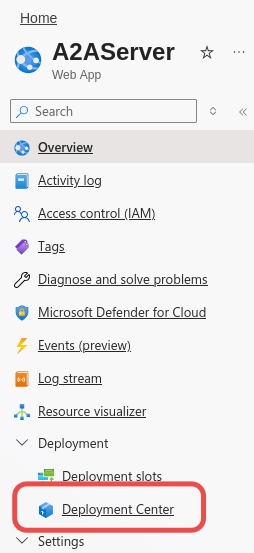
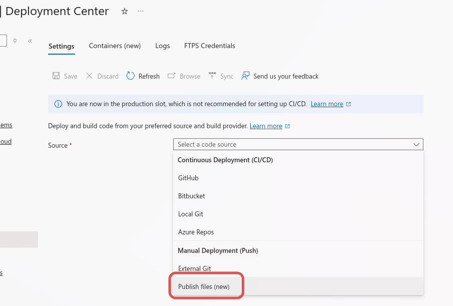

# Redeploying

## Purpose

This document is the source of truth for redeploying `src/a2a_servers` after changing agent definitions or server code.

Use this after:

- adding a new `*_agent.toml`
- changing agent metadata
- changing server code under `src/a2a_servers`

Do not use this for Azure hosting design decisions. For the broader deployment shape, see [deployment-azure.md](./deployment-azure.md).

## Important Boundary

Changing files in this repo does not update the running Azure service.

If you add or edit an agent definition, you must redeploy the app before production will serve the new or updated agent.

You do not need local dev setup or Dev Tunnels to perform a production redeploy.

## Before Redeploying

Confirm:

- the target Foundry agent already exists in the Azure AI Foundry project used by production
- every changed `foundry.agent_name` exactly matches the real portal-managed agent name
- the deployment artifact includes the `agents/` directory
- the deployed app settings still point at the correct Foundry project

If you are deploying a newly added agent, complete [adding-agents.md](./adding-agents.md) first.

## What Must Be Present In Production

The deployed app needs:

- the `src/a2a_servers` application files
- the correct startup command
- the required environment variables

Required runtime settings are documented in [deployment-azure.md](./deployment-azure.md) and should already be there. you shouldn't have to touch anything besides uploading a new zip
Required runtime settings are documented in [deployment-azure.md](./deployment-azure.md) and should already be present. In most redeploys, the only change needed is uploading a new zip artifact.

## Redeploy Procedure

### 1. Prepare the artifact

Deploy the flat `src/a2a_servers` app contents so the artifact root contains files such as:

- `__main__.py`
- `agent_definition.py`
- `app_factory.py`
- `agents/`
- `pyproject.toml`

> ⚠️ **CRITICAL**: When creating the artifact, navigate **into** the `a2a_servers` directory, select all contents, then zip. Do **not** zip from `/src` or the parent directory—this will create a nested structure and the app will fail to start.

Correct:

```bash
cd src/a2a_servers
zip -r ../a2a_servers.zip .
```

Incorrect (app will not start):

```bash
cd src
zip -r a2a_servers.zip a2a_servers/
```

### 2. Deploy to the existing Azure host

1. log into the portal
2. open the A2AServer webApp
3. go to deployment center

4. select publish files as your code source
5. click upload and select the `a2a_servers.zip` artifact

6. press save to start deployment
7. wait for deployment completion and monitor the log stream periodically

### 3. Verify the deployment

After deployment, verify:

1. `GET /` lists the expected agents.
2. `GET /<slug>/health` works for the changed agent.
3. `GET /<slug>/.well-known/agent-card.json` returns the expected metadata.
4. the published card URLs use the real Azure hostname, not `localhost`.

### 4. Run a smoke test against the deployed host

From `src/a2a_servers` or another trusted environment with the repo available:

```bash
uv run python test_client.py --agent-slug <slug> --base-url https://<your-app-hostname>
```

`--base-url` should be the server base host only. The client appends `/<slug>`.

## Related Documents

- add a new agent: [adding-agents.md](./adding-agents.md)
- Azure deployment shape: [deployment-azure.md](./deployment-azure.md)
- troubleshoot bad deploys: [troubleshooting.md](./troubleshooting.md)
